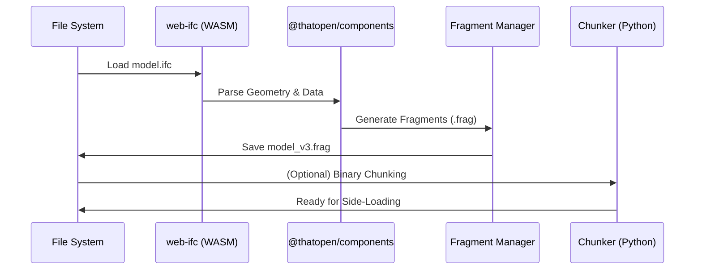

# V3 BIM Converter (IFC to Fragment)

**V3_Conv** is a high-performance conversion utility designed to transform **IFC (Industry Foundation Classes)** building models into the optimized **Fragment (.frag)** format. 

This tool is a core component of the [Antigravity](https://github.com/textonym/antigravity) ecosystem, enabling massive BIM models to be visualized efficiently in environments like Power BI through optimized geometry and side-loading.

## Workflow

The converter uses a headless Node.js environment powered by the **@thatopen** (formerly OpenBIM) stack:



## Key Features

- **V3 Fragment Support**: Utilizes the latest `@thatopen/components` for maximum compatibility and performance.
- **Headless Processing**: Custom polyfills (JSDOM-less) for Node.js to enable 3D libraries to run without a browser.
- **Data Optimization**: Automatic coordinate centering and profile optimization to reduce file size.
- **Python Integration**: Includes a binary chunking utility (`chunker.py`) for preparing models for Power BI's data limits.

## Setup & Usage

### Prerequisites
- Node.js
- Python 3.x (Optional, for chunking)

### Installation
```bash
npm install
```

### Conversion for Antigravity (V3)
1. Place your `model.ifc` in the root folder.
2. Run the V3 conversion script:
```bash
node convert_v3.js
```

The output `model_v3.frag` will be generated, ready for the Antigravity viewer.

## Technical Stack

- **Geometry Engine**: [web-ifc](https://github.com/ThatOpen/web-ifc)
- **Component System**: [@thatopen/components](https://docs.thatopen.com/)
- **Runtime**: Node.js & Three.js
- **Post-Processing**: Python

## Credits & Acknowledgements

V3_Conv relies on the work of the following communities and contributors:

- **[ThatOpen/web-ifc](https://github.com/ThatOpen/web-ifc)** — For the high-performance building model parsing engine.
- **[ThatOpen/openbim-components](https://github.com/ThatOpen/openbim-components)** — Forkable framework for 3D BIM components and fragments.
- **[Three.js](https://github.com/mrdoob/three.js)** — For the geometry engine and 3D environment.
- **[IFC-Lite](https://github.com/louistrue/ifc-lite)** by **Louis True** — For the research and patterns relating to side-loading fragments and binary chunking in Power BI.

## License
MIT
